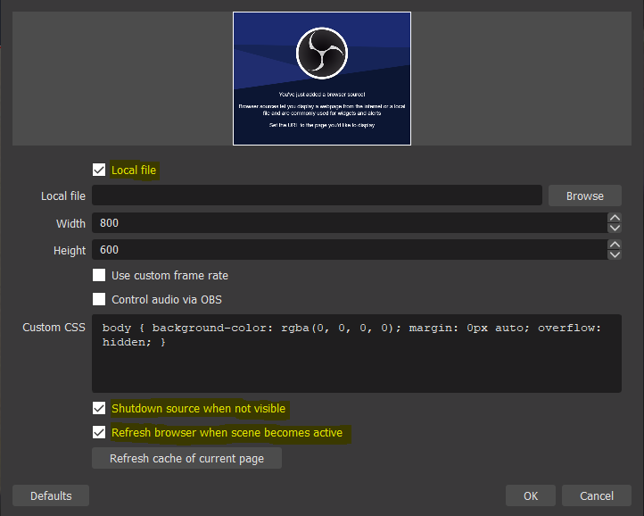
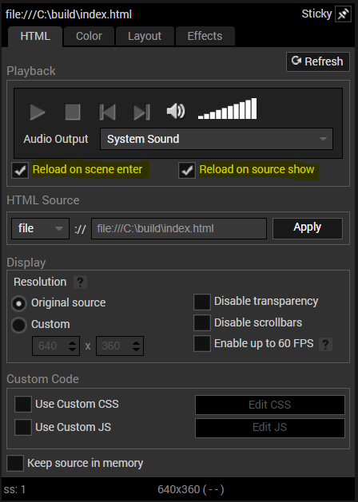

# 10/0 Max Mille Documentation

# Table of Contents

1. [Configuration](#configuration)
2. [Getting Started](#getting-started)
3. [Adding to OBS or XSplit](#adding-to-obs-or-xsplit)
   1. [Open Broadcaster Software (OBS)](#open-broadcaster-software-obs)
   2. [XSplit](#xsplit)
4. [FAQ](#faq)

## Configuration

Before [getting started](#getting-started), you will have to [configure your AWS environment](https://awscli.amazonaws.com/v2/documentation/api/latest/reference/configure/index.html) and set a few important environment variables for both the stream source build and the backend deploy.

The recommended way to set environment variables is to create a `.env` file in the project's root directory.

The following are the _required_ environment variables that need to be set:

- **STAGE** - dev, test, prod or whatever you like. The Serverless Framework will prepend this value to each backend endpoint.
- **TWITCH_CLIENT_ID** - This application integrates with the Twitch Helix API. The client ID is obtained after registering your application with Twitch in the [Twitch Developer Console](https://dev.twitch.tv/).
- **TWITCH_CLIENT_SECRET** - Along with the client ID, the client secret is obtained after registering your application with Twitch.
- **MAX_MILLE_API_URL** - The root endpoint url of the backend service. If you are not using Amazon Route 53, you will have to obtain this value _after_ deploying the backened using the Serverless Framework.
- **MAX_MILLE_STATUS_INTERVAL** - The interval in miliseconds the stream source reports status to the backend when it is live in the active scene. Default is 60,000 miliseconds or 1 minute.

Example `.env` file:

```
STAGE=prod

TWITCH_CLIENT_ID=abcdefghijklmnop12345
TWITCH_CLIENT_SECRET=12345abcdefghijklmop

MAX_MILLE_API_URL=https://abcd1234.execute-api.us-west-1.amazonaws.com/prod/
MAX_MILLE_STATUS_INTERVAL=60000
```

## Getting Started

Install all the dependencies:

```
$ npm install
```

[Configure](#configuration) AWS environment and set environment variables.

Deploy backend:

```
$ sls deploy
```

Build the stream source:

```
$ npm run build
```

Add the `index.html` from the resulting `build` directory to OBS or XSplit as a Browser or Webpage source to your desired scene.

## Adding to OBS or XSplit

### Open Broadcaster Software (OBS)

Add a Browser source to your desired scene. Enable the `Local file` checkbox and browse for the `index.html` that was created from building the stream source.

`Shutdown source when not visible` and `Refresh browser when scene becomes active` _need_ to be enabled.



### XSplit

Add a Webpage source to your desired scene. Browse for the `index.html` from the resulting `build` directory that was created from building the stream source.

Right click on the Browser source and enable `Reload on scene enter` and `Reload on source show`.



**Do not** enable `Keep source in memory` as this will prevent proper interval reporting.

## FAQ

### Why is it called 10/0 Max Mille?

The name comes from a running gag and meme in the Fighting Game Community (FGC) referred to as "MAX CPM". CPM is an marketing and advertising term which stands for "Cost Per Mille" and denotes the cost per thousand ad impressions. MAX CPM is used to denote when a live streamer is overtly seeking the maximum ad revenue and sellout potential of their live stream.

### Why did you vendor lock-in to Amazon Web Services (AWS)?

Because Twitch, Amazon, and Lord Bezos. Also because I am going for my AWS certifications.
